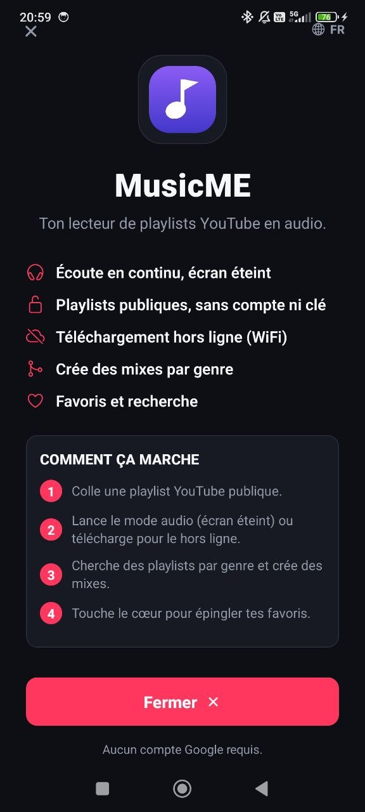
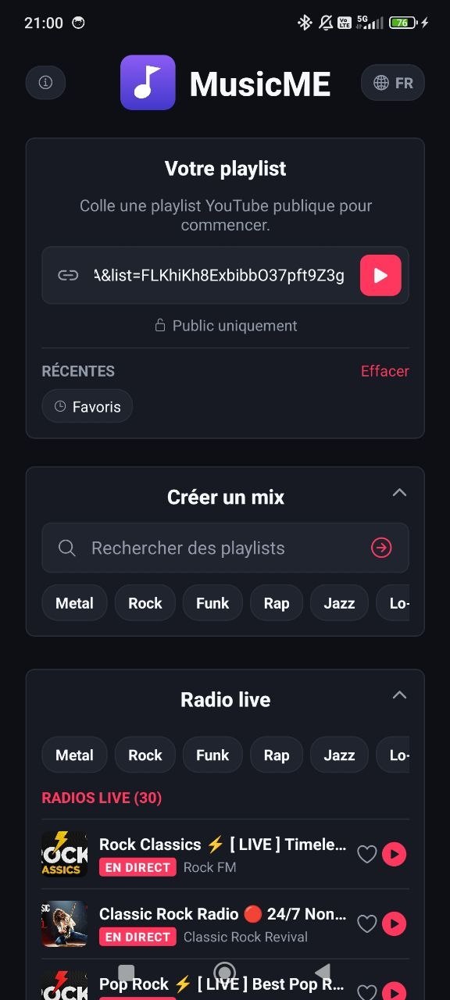
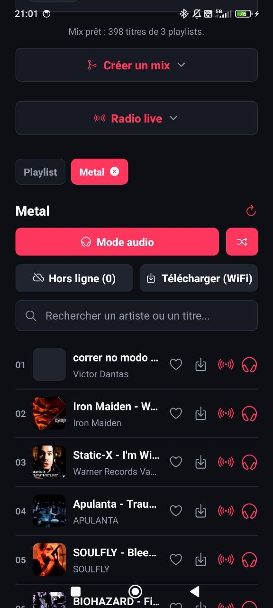
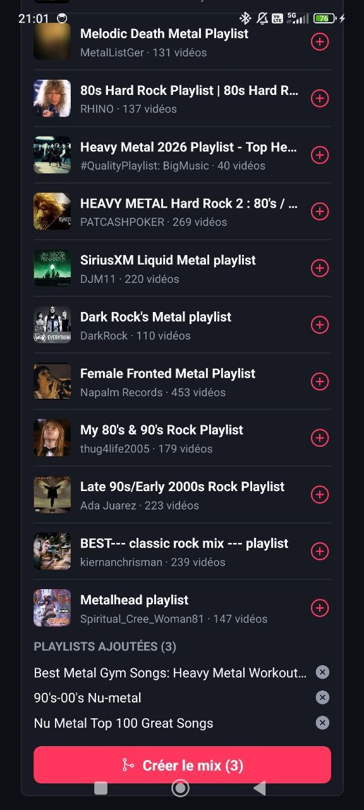
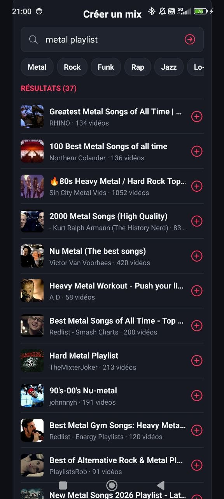

# MusicME 🎧

Paste a **public** YouTube playlist and listen to it in the background, **with the
screen off**, no Google account, no API key.

## Features

- 🎧 Continuous playback, screen off
- 🔀 Genre mixes (up to 3 merged playlists)
- 📻 Live radio (Lofi, Metal, Jazz, Rock…)
- ❤️ Favorites and search
- 🌐 FR / EN

## 📸 Screenshots

| | |
|---|---|
|  |  |
|  |  |
|  | |

## 📥 Install the app

The APK is available in the **[Releases section](https://github.com/stevegoste/musicme/releases)**
of this page.

1. Download `app-release.apk` from the latest release.
2. **Enable unknown sources**: open your phone **Settings → Apps → Special app access → Install unknown apps** (or *Settings → Security* on some devices) and allow your browser/file manager to install apps.
3. Open the downloaded APK file and tap **Install**.
4. Open the app and paste the link to your public YouTube playlist. 🎧

> ⚠️ **First install**: Android blocks apps that don't come from the Play Store.
> You must **allow "Install unknown apps"** for your browser or file manager in
> the device settings, otherwise the installation will be rejected.

## 🔄 Install via Obtainium (auto-updates)

[Obtainium](https://obtainium.imranr.dev/) installs the app directly from the
GitHub Releases and **updates it automatically**:

1. Install **Obtainium** from [obtainium.imranr.dev](https://obtainium.imranr.dev/).
2. Open Obtainium → **+** (Add app).
3. Source: **GitHub Releases**.
4. Link: `https://github.com/stevegoste/musicme`.
5. APK filter: `app-release\.apk`.
6. Tap **Add** → the app installs and updates itself. 🔄

## 🚧 Status

Active development.

---

*For developers: see [`DEVELOPING.md`](DEVELOPING.md).*

## ☕ Support the project

MusicME is **free and ad-free**. If the app helps you every day, a small
donation is always welcome to cover the costs (server, coffee ☕):

- **GitHub Sponsors** — [github.com/sponsors/stevegoste](https://github.com/sponsors/stevegoste)
- **[Ko-fi](https://ko-fi.com/ton-pseudo)** — one-time or recurring donation
- **[PayPal](https://www.paypal.me/ton-pseudo)** — a quick tip

Thanks for your support! 🙏
